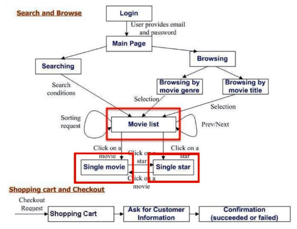
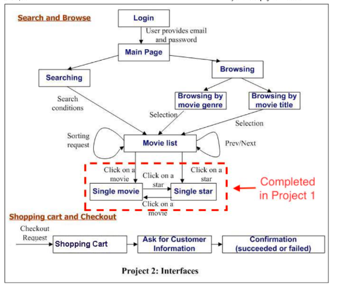
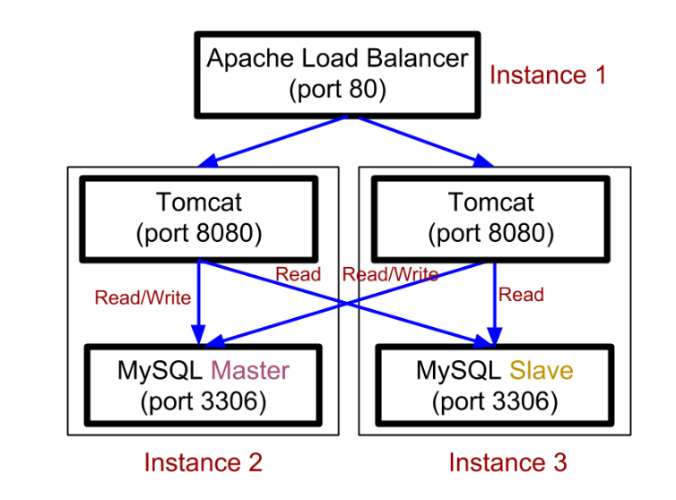

# Movie Database Search System
March - May 2023
## Introduction

This project is designed to develop a comprehensive movie management and shopping system, focusing on a robust database structure, dynamic web application features, and advanced security and performance enhancements. The project is divided into multiple stages to ensure a systematic approach to development and deployment.

## Stage 1: Database and Web Pages

Stage 1 sets the foundation with the creation of a detailed MySQL database and the development of essential web pages. The database schema includes tables for movies, stars, genres, customers, and sales, which will be utilized to support a rich set of functionalities. The web pages include a movie list, individual movie and star pages, with navigation to seamlessly connect these components.

### 1. Database Creation:
- **Database**: `moviedb`
- **Tables**:
  - `movies`: Stores movie details.
  - `stars`: Stores star details.
  - `stars_in_movies`: Maps stars to movies.
  - `genres`: Defines genres.
  - `genres_in_movies`: Maps genres to movies.
  - `customers`: Contains customer data.
  - `sales`: Records movie sales.
  - `creditcards`: Stores credit card details.
  - `ratings`: Stores movie ratings.

### 2. Web Pages:

- **Movie List Page**: Displays top 20 rated movies with key details.
- **Single Movie Page**: Provides comprehensive details about a specific movie.
- **Single Star Page**: Shows details about a star and their movies.
- **Navigation**: Allows seamless transition between the movie list, movie details, and star details pages.

## Stage 2: General Requirements and Features

Stage 2 introduces critical functionalities and requirements for the web application. This stage emphasizes user authentication, search and browse capabilities, shopping cart management, and the implementation of interactive features such as sorting and pagination. The focus is on building a Single Page Application (SPA) with a user-friendly interface while adhering to best practices for secure transactions and session management.

### 1. Login Page:
- **Functionality**: Redirect unauthorized users, handle login via HTTP POST, display error messages, and include a logout option.

### 2. Main Page:
- **Access**: Available after login, with links to search and browse functionality.

### 3. Search and Browse:
- **Search**: By title, year, director, or star’s name, supporting substring matching.
- **Browse**: By genre or title’s starting character.

### 4. Movie List Page:
- **Features**: Display movies with sorting (by title or rating) and pagination. Include "Prev/Next" buttons and maintain session state.

### 5. Single Pages:
- **Single Movie Page**: List all genres, stars, and ratings for a movie.
- **Single Star Page**: List all movies featuring a star.

### 6. Shopping Cart:
- **Cart Page**: Display items, modify quantities, and delete items.
- **Payment Page**: Collect and validate payment information.
- **Place Order**: Process orders and handle confirmation.

### 7. Additional Features:
- **Add to Cart/Checkout**: Buttons for adding movies to cart and proceeding with checkout.
- **Session State**: Maintain session state across pages.

## Stage 3: Security and Backend Enhancements

Stage 3 focuses on enhancing the application's security and backend functionalities. Key tasks include integrating reCAPTCHA to prevent automated abuse, implementing HTTPS to ensure secure data transmission, and using PreparedStatements to mitigate SQL injection risks. Additionally, encrypted passwords and a secure employee dashboard are introduced, along with the ability to import XML data into the database.

### 1. reCAPTCHA:
- **Setup and Integration**: Integrate reCAPTCHA into login for additional security.

### 2. HTTPS:
- **Configuration**: Create a keystore, configure Tomcat for HTTPS, force HTTPS redirection, and ensure all interactions use HTTPS.

### 3. PreparedStatements:
- **SQL Queries**: Use PreparedStatement to prevent SQL injection.

### 4. Encrypted Passwords:
- **Password Handling**: Encrypt passwords and update login logic to validate encrypted passwords.

### 5. Dashboard with Stored Procedures:
- **Employee Dashboard**: Create and secure a dashboard for employee operations.
- **Stored Procedure**: Implement for movie addition functionality.

### 6. XML Data Import:
- **Parsing and Optimization**: Write Java programs for XML data import and optimize performance.

## Stage 4: Advanced Features

Stage 4 advances the project with sophisticated search features, including full-text search, autocomplete, and fuzzy search capabilities. These features are designed to improve the user experience by providing intelligent search options. The development of an Android app extends the functionality of the web application to mobile platforms, replicating core features with additional mobile-specific enhancements.

### 1. Full-Text Search and Autocomplete:
- **Full-Text Search**: Enhance search with intelligent keyword handling.
- **Autocomplete**: Implement suggestions and keyboard navigation, cache suggestions, and log actions.

### 2. Fuzzy Search:
- **Implementation**: Handle misspellings using fuzzy search techniques.

### 3. Android App Development:
- **Setup**: Create an Android app mimicking web functionality.
- **Features**: Include login, movie list, and single movie details. Implement autocomplete and pagination.

## Stage 5: Scaling and Performance

Stage 5 culminates in scaling and performance optimization. This stage includes the implementation of JDBC connection pooling, MySQL master-slave replication, and load balancing with Apache and Tomcat to handle increased traffic and ensure high availability. Performance measurement using JMeter will help assess and optimize the application's responsiveness and efficiency.

### 1. JDBC Connection Pooling:
- **Setup**: Implement connection pooling for efficiency and use prepared statements.

### 2. MySQL Master-Slave Replication:
- **Configuration**: Set up replication to enhance database performance.

### 3. Scaling with Load Balancers:
<!--  -->

- **Tomcat and Apache**: Configure for load balancing and session management.
- **Performance Measurement**: Log execution times and use JMeter for load testing.
- **Google Cloud Platform (GCP)**: Optionally set up load balancing on GCP.

## Conclusion

Overall, this project aims to create a scalable, secure, and user-friendly movie management system that performs efficiently across web and mobile platforms.

## More Info
For additional details, please refer to the specification folder.
