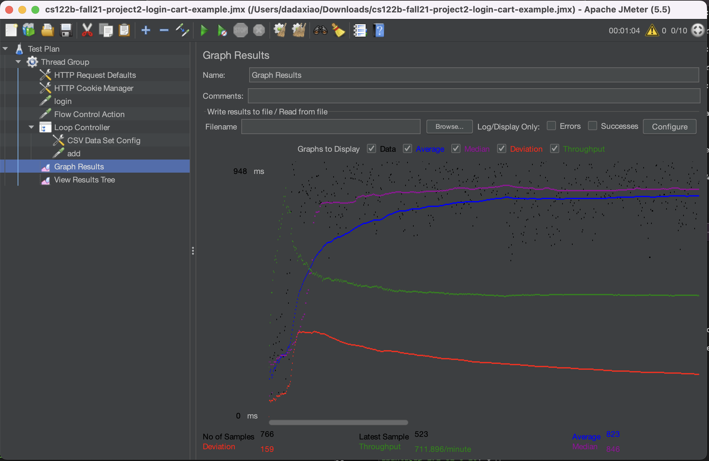
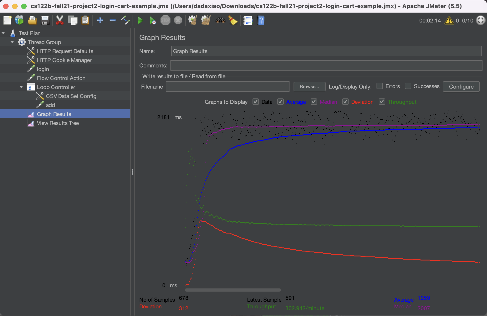
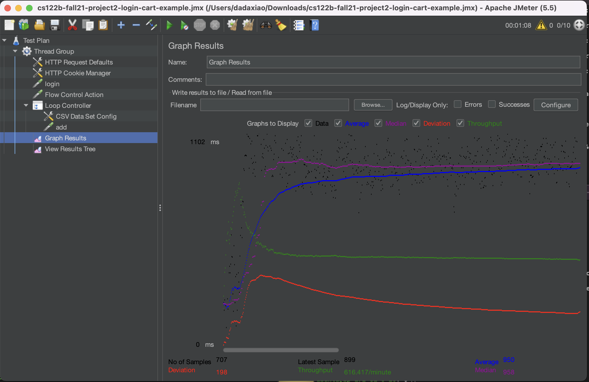
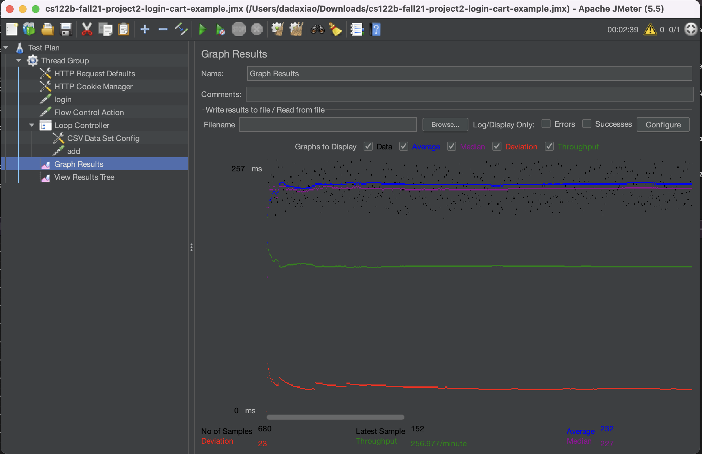
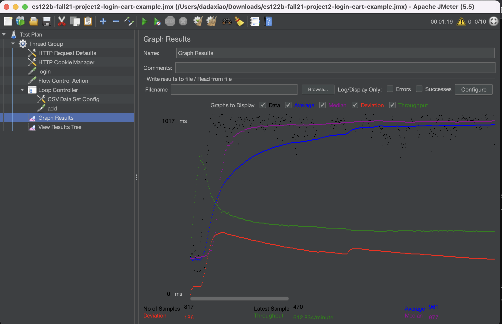

- # General
    - #### Team#: s23-122b-cs122b-888
    
    - #### Names: Yan Xiao and Zhenwen Li
    
    - #### Project 5 Video Demo Link: https://youtu.be/JAKtuKEk2nU
    

    - #### Instruction of deployment: 
If needed, create images/instances/inbound rules to prepare for the intended use. Edit the code files, configuration files, and etc, such as context.xml 
and web.xml to abide by the needs for the testing or using. Be especially careful with the IP addresses. After done editing, there are two ways to test the 
server, through the Jmeter GUI or through the command line. GUI is easier for visualization and editing, while command line give more accurate data. The 
steps are create and/or edit a plan to suit the needs and then run Jmeter. While running Jmeter, we can also open the Tomcat logs to track the status of 
the threads. Jmeter will come with its own data, but TS and TJ datas are found in this path, 
/var/lib/tomcat10/webapps/cs122b-project1-api-example/'\log.txt', which need processing; using log_processing.py. Can also utilize other logs such as MySQL 
logs, system logs, etc to check the status of the instance overall.

    - #### Collaborations and Work Distribution:
	We worked on everything together through zoom.

### Note to grader: We really tried our best. The instances kept going down (such as with 100% CPU) which really ate up our time. We are also worried that 
it will go down when you are testing it.

- # Connection Pooling
    - #### Include the filename/path of all code/configuration files in GitHub of using JDBC Connection Pooling.
	Configuration: 
		WebContent/META-INF/context.xml

		WebContent/WEB-INF/web.xml

	Code (that used PreparedStatement):
		
		VerifyPassword.java

		ConfirmationServlet.java

		_dashboard.java

		InsertMovieServlet.java

		InsertStarServlet.java

		LoginServlet.java

		MoviesServlet.java

		PaymentServlet.java

		SAXParserXML.java

		ShoppingCartServlet.java

		SingleMovieServlet.java

		SingleStarServlet.java 

		FullTextServlet.java

		AutoCompleteServlet.java
    
    - #### Explain how Connection Pooling is utilized in the Fabflix code.
We basically utilize Connection pooling everywhere we need to make a connection to the MySQL database. This allows Fablix to reuse connections in the pool 
and save on the time it takes to establish a connection everytime we need to access MySQL database. We allow for a max of 100 connections with a max idle 
connections of 30. This prevents too many idle connections from using up the system resources while leaving some on lookout for connections.
    
    - #### Explain how Connection Pooling works with two backend SQL.
The maxIdle is 30 so that means if both of these SQL needs a connection at the same time, they will create a connection the first time they need it. After 
that the two connection gets reused without needing to connect again because it does not exceed the maxIdle so it was not closed. If one of these SQL made 
connection first and the second SQL make connection after the first SQL is done, it will reuse that one connection in the pool.
    

- # Master/Slave
    - #### Include the filename/path of all code/configuration files in GitHub of routing queries to Master/Slave SQL.

		_dashboard.java

		AutoCompleteServlet.java

		ConfirmationServlet.java

		FullTextServlet.java

		InsertMovieServlet.java

		InsertStarServlet.java

		LoginServlet.java

		MainServlet.java

		MetadataServlet.java

		ModifyQuantityServlet.java

		MoviesServlet.java

		PaymentServlet.java

		ShoppingCartServlet.java

		SingleMovieServlet.java

		SingleStarServlet.java

		Top20MovieServlet.java

		VerifyPassword.java
 

    - #### How read/write requests were routed to Master/Slave SQL?
    
We used MySQL router to achieve this. We set up 2 ports (7001 and 7002) for read and write/read respectively. Then based on the need of the servlet, we use 
the datasource for port 7001 or 7002. Port 7001 is for read which will redirect the incoming to either the slave or the master. 7002 is for read and write, 
which will redirect to the master. If a write request is sent to the slave or the master, it will send a request to the 7002, so only the master MySql 
Database can handle it. If a read request is sent to the slave or the master, it will send a request to the 7001, so either the master or the slave MySql 
Database can handle it.

- # JMeter TS/TJ Time Logs
    - #### Instructions of how to use the `log_processing.*` script to process the JMeter logs.

Get the log files out from /var/lib/tomcat10/webapps/cs122b-project1-api-example/'\log.txt'. It can be one or two log files. Go to the location where the 
script lays and run
	
	python log_processing.py [log_file_path] [log_file_path]

Can put one or two logs in the command line.

- # JMeter TS/TJ Time Measurement Report

The data in these files are in nanoseconds.
	*[log/single_case1.txt](log/single_case1.txt)
	*[log/single_case2.txt](log/single_case2.txt)
	*[log/single_case3.txt](log/single_case3.txt)
	*[log/single_case4.txt](log/single_case4.txt)
	*[log/scaled_case1.txt](log/scaled_case1.txt)
	*[log/scaled_case2.txt](log/scaled_case2.txt)
	*[log/scaled_case3.txt](log/scaled_case3.txt)

**Important Note: We really tried our best and followed the instructions but the average time on Jmeter is still really high, despite the queries in the 
servlet being < 100 ms. This is likely because the way we did it was we created a new servlet just for full text search that acted like the movie servlet, 
which produced the results for the table (because the table was needed and doing it at once will save the transit time of data and connection). There was 
no restriction on how to implement the project as it seems in the instructions. This likely caused the time to be off. And previously, the requirement was 
that an action can be finished in 500 ms and we were able to achieve that.**

| **Single-instance Version Test Plan**          | **Graph Results Screenshot** | **Average Query Time(ms)** | **Average Search Servlet Time(ms)** | 
**Average JDBC Time(ms)** | **Analysis** |
|------------------------------------------------|------------------------------|----------------------------|-------------------------------------|---------------------------|--------------|
| Case 1: HTTP/1 thread                          |     | 243                        | 59.0711032462585                    | 
57.75808269251701                        | Using preparedstatements and connection pooling allowed the queries and connections to be "stored" and reused, 
thus eliminate the time it needs to parse, optimize, etc a query if the "template" is the same as another query that was prepared already. As for 
connection, having a pool decreases the need to constantly open and close connections, thus saving the connection times.|
| Case 2: HTTP/10 threads                        |     | 823                        | 60.61931784090909                   | 
59.752344197860964                       | Running 10 threads will be slower than running one because it is a single instance so we can't shift the load 
somewhere else to lighten the burden. Though TS and TJ times are still pretty similar.   |
| Case 3: HTTPS/10 threads                       |     | 1959                       |  60.22469451289833                  | 
58.95946306525038                        | This needs redirecting from http to https so will need additional time, making the total query time higher than 
case 2 despite everything else being the same.     |
| Case 4: HTTP/10 threads/No connection pooling  |     | 950                        | 66.18018140988372                   | 
63.61416220930233                        | Without connection pooling causes the server to spend more time connecting and disconnecting and thus, it will 
also be slower than case 2.           |

| **Scaled Version Test Plan**                   | **Graph Results Screenshot** | **Average Query Time(ms)** | **Average Search Servlet Time(ms)** | 
**Average JDBC Time(ms)** | **Analysis** |
|------------------------------------------------|------------------------------|----------------------------|-------------------------------------|---------------------------|--------------|
| Case 1: HTTP/1 thread                          |     | 232                        | 45.23214661119293                   |  
44.217158475699556                  | The time between this case and case 1 for single instance is pretty similar despite being scaled, as the scaled 
version is not used to its full potential, though the query for this case can either go to master or slave (since it's read).         |
| Case 2: HTTP/10 threads                        |     | 961                        | 44.87798108                         | 
43.88480613375             | Since this is scaled/load balanced, it can handle the 10 threads through passing the job off from the load balancer to either 
the instance 2 or instance 3. The TS and TJ is well below the 500 ms. As for the results in the Jmeter, we used the GUI because we needed the graph so that 
also has an effect.|
| Case 3: HTTP/10 threads/No connection pooling  |     | 957                        | 46.516253699724516                  | 
44.420959735537195                        | Theoretically, without connection pooling, the results should be slower than with connection pooling, but there 
are other factors that needs to be taken into account such as the state of the server, state of jmeter, etc. The difference is not that great between 
scaled case 2 and 3.          |

================================================================================================================================================================
General

Teams s23-122b-cs122b-888

Names: Yan Xiao, Zhenwen Li

Project 4

Link: https://youtu.be/kmfNUdvNxDw

Full Text: Worked on it together

Auto Complete: Worked on it together

Android: Worked on it together

For fuzzy, we decided that it will only be triggered if full-text search can't find anything as we notice that depending on the entry, the result of the 
fuzzy search can go wild. And the threshold we implemented depends on the length of the entry, which is less than the floor of one-third of the length of 
the string inputted. We noticed that if users enter something that makes more mistakes than that, the results from the fuzzy search are likely no longer 
meaningful. If the number of steps to reach this title reach or go above the floor(1/3) of the length of the string for this comparison, we don't output 
this title. If this previous condition is not met, we also check for substring matching. We make use of the or condition in this case. One more thing we 
considered is that given our context, we ignored capitalization, so all letters will be treated as lowercase.

Video and Readme: Worked on it together

Project 3

Link: https://youtu.be/uCwyOp1ynUo

(Note: we used Zoom to remote control the screen so if the mouse jumps, that's not because we cut the video.)

Contributions:

reCaptcha: Worked on it together

HTTPS Implimentation: Worked on it together

PreparedStatements: Most were already done from previous projects. Yan finished the rest.

Encrypted Password: Worked on it together.

Dashboard: Yan worked on the servlet and interface, Zhenwen worked on the SQL procedures.

XML: Zhenwen wrote the code with Yan's help. Yan also took care of AWS issues.

Others: We worked on it together.

Files that used Prepared Statements

VerifyPassword.java

ConfirmationServlet.java

_dashboard.java

InsertMovieServlet.java

InsertStarServlet.java

LoginServlet.java

MoviesServlet.java

PaymentServlet.java

SAXParserXML.java

ShoppingCartServlet.java

SingleMovieServlet.java

SingleStarServlet.java

We implemented two types of optimization.

HashMap: We created HashSets for checking against the stars and movie ids that are used in the xml for quick check on duplication as well as existence for 
stars_in_movies adding. We also implemented HashMaps for checking the existing database entries of data in stars, movies, and stars_in_movie, as well as 
using it to get the ids in our database.

executeBatch: We used executeBatch in three places. Once after every xml file. We execute calls to procedures for one xml all at once then query for its 
table (for actors and main xmls) and store the data in HashMaps. This is so that we can use it for adding to stars_in_movies table.

By implementing both techniques, it takes 1:05 minute to run, but without it, it would go beyond the required 15 minutes requirement.

Inconsistent Data: Please refer to the unique2.txt

Some Notes

Decided to create the hash table with movie title because we noticed inconsistencies with the director names between the files, like one use full name and 
the other use last name. In the beginning, we wanted to compare against director and movie.

The instructions says: "For entries with multiple ISBN/publishers/etc, only use one of them." So we decided to only consider one of the genre.

We did a find on the number of tags in casts and the result is 48,938.

General

Teams s23-122b-cs122b-888

Names: Yan Xiao, Zhenwen Li

Project 2 Video Link: https://www.youtube.com/watch?v=cpPfeuJSfw4

Member Contribution

Main Page: Zhenwen worked on the searches and browsing. Yan helped debug and css/html

Login: Did it together

Movie List: sort and paging: Zhenwen and Yan helped debug

Cart, confirmation, add to cart, payment: Yan worked on it and Zhenwen helped debug.

Redirecting from single pages using session: Zhenwen worked on it

Video: Yan filmed it and Zhenwen overlooked

Readme: Wrote together

Other tasks: we worked together

We used like in searches and browsing in movieServlet to check for substring. Used regexpr for *

// ====================================================================================

Project 1 Video Link: https://www.youtube.com/watch?v=AwtaZU_b67w

Setup: We used Yan's setup because Zhenwen joined late (Week 2 on Thursday night due to pre-requisite restrictions), so she only had time to partially set 
up. However, she did help debug and research for error solutions.

Code: We coded all the pages together on Yan’s local machine through Zoom.

Video: We made the video together through Zoom. Note: During the process of recording the video, we did switch the control of the computer. If you see a 
jump in the mouse, it is not because we cut the video; it is caused by the control switch.

README: We wrote it together through Zoom.

